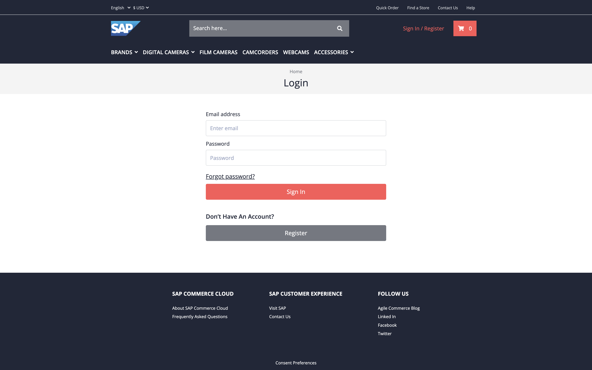
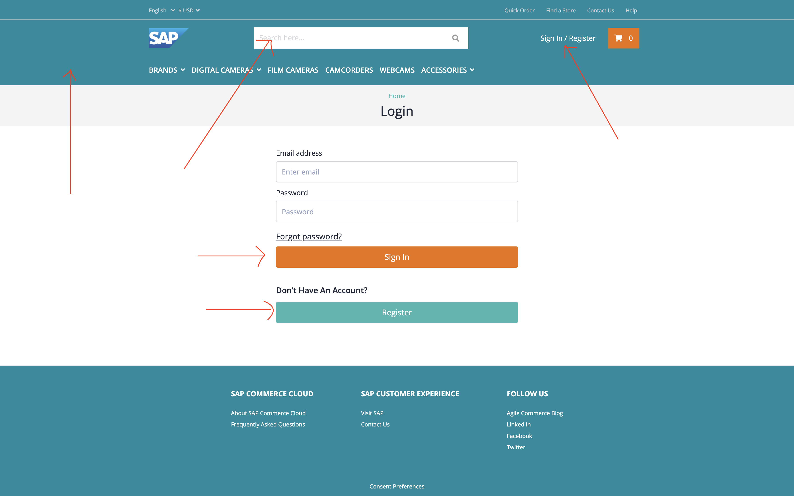

# Before

# After

# Files Changed
[login.scss](src/styles/spartacus/custom/login.scss)
[searchbox.scss](src/styles/spartacus/custom/searchbox.scss)
[index.scss](src/styles/spartacus/custom/index.scss)
[styles.scss](src/styles.scss)
